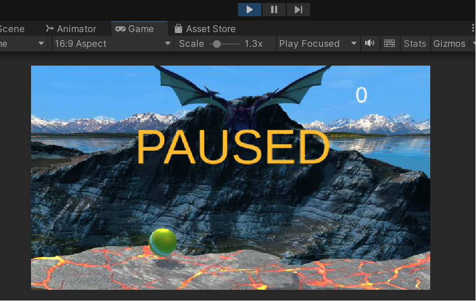

# Разработка игровых сервисов Лабораторная работа #4
Отчет по лабораторной работе #4 выполнил(а):
- Хафизова Анна Эдуардовна
- РИ300012
Отметка о выполнении заданий (заполняется студентом):

| Задание | Выполнение | Баллы |
| ------ | ------ | ------ |
| Задание 1 | * | 60 |
| Задание 2 | * | 20 |
| Задание 3 | * | 20 |

знак "*" - задание выполнено; знак "#" - задание не выполнено;

Работу проверили:
- к.т.н., доцент Денисов Д.В.
- к.э.н., доцент Панов М.А.
- ст. преп., Фадеев В.О.

[](https://nodesource.com/products/nsolid)

[](https://travis-ci.org/joemccann/dillinger)

Структура отчета

- Данные о работе: название работы, фио, группа, выполненные задания.
- Цель работы.
- Задание 1.
- Код реализации выполнения задания. Визуализация результатов выполнения (если применимо).
- Задание 2.
- Код реализации выполнения задания. Визуализация результатов выполнения (если применимо).
- Задание 3.
- Код реализации выполнения задания. Визуализация результатов выполнения (если применимо).
- Выводы.
- ✨Magic ✨

## Цель работы
подготовить разрабатываемое интерактивное приложение к
сборке и публикации.


## Задание 1
### Используя видео-материалы практических работ 1-5 повторить реализацию приведённого ниже функционала.

Ход работы:

**1.   Создание анимации объектов на сцене.**
   
Сначала мы переименовали нашу главную сцену _0scene в _1scene, создали дубликат _1scene и переименовали её в _0scene для создания меню.
В сцене 0 удалили объекты ground и score. Удалили скрипты у Main Camera и Enemy.

Далее изменили координаты объекта DragonMountain на координаты, которые указаны в видео, чтобы получился красивый задний фон. Точно таким же образом изменили расположение дракона на экране. Это можно заметить на скриншоте ниже:


Создали в _Animations **Animator Controller** под названием **DragonIDLE** и добавили туда стоящую модельку дракона **idle01**. После чего к модельке дракона подключили этот контроллер, как показано на скриншоте ниже:


Далее ещё немного поигрались с расположением дракона, горы и камеры, после чего скачали новый asset **Painted HQ 2D Forest Medieval Background** для добавления анимации облаков.

Анимацию облаков добавили следующим образом: нажали на **Window - Animation - Animation - Create a new one** и создали новую анимацию под названием **CloudAnimation** в папке assets в подпапке **_Animations**.
Далее в окне **Animations** с помощью ключей настраиваем позицию облака, тем самым создавая простую анимацию. Также облаку добавляем компонент **Rect Transform**, чтобы облако у нас всегда начинало свою анимацию с правого верхнего угла экрана пользователя.

На гифке ниже можно увидеть зацикленную анимацию облака:


**2. Создание стартовой сцены и переключение между ними.**


Создали новый игровой объект **Text - Text Mesh Pro**, установили у него **Rect Transform** на левый верхний угол. Настроили размер и цвет шрифта, его расположение.
Создали новый пустой объект **MainMenu** и новый скрипт **MainMenu**, который подключили к пустому объекту.

В скрипте подключили библиотеку 
```c#
using UnityEngine.SceneManagement;
```
И написали следущий код для загрузки новой сцены по индексу и выходу из игры (который будет работать только в готовой сборке, а не прототипе):

```c#
public class MainMenu : MonoBehaviour
{
    public void PlayGame(){
        SceneManager.LoadScene(SceneManager.GetActiveScene().buildIndex + 1);
    }

    public void QuitGame(){
        Application.Quit();
    }
}
```

Далее создали три кнопки через меню GameObject и назвали их **PlayButton, OptionButton и QuitButton**.

Настроили внешний вид, шрифты и расположение этих кнопок и добавили к кнопке **PlayButton** в **On Click MainMenu** запуск необходимого нам события (*MainMenu.PlayGame*):


Таким образом, при запуске игры при нажатии на кнопку **PLAY** у нас загружается следующая сцена с самой игрой.


**3.  Доработка меню и функционала с остановкой игры.**

Создаём копию **MainMenu** со всеми входящими туда кнопками и переименовываем её в **SettingMenu**. Далее в кнопке **BackButton** на функции **On Click** добавляем сразу два метода: **MainMenu и SettingMenu**, на первую ставим галочку **SetActive**, а на вторую нет. Таким образом при событии **On Click** одно меню будет становиться активным, а второе будет деактивироваться. Данную настройку можно увидеть на изображении ниже: 
 

То же самое, но с противоположными галочками, повторяем с OptionButton в **SettingMenu**.


На гифке ниже можно увидеть, что при нажатии на кнопку **OPTIONS** у нас открывается окно настроек, а при нажатии кнопки **BACK** мы возвращаемся обратно.
 

Пишем следующий код в новом скрипте для корректной работы паузы и выхода из игры при нажатии на кнопки пробел и escape соответственно.
```c#
void Update()
    {
        if (Input.GetKeyDown(KeyCode.Space)){
            if (!paused){
                Time.timeScale = 0;
                paused = true;
                panel.SetActive(true);              
            }
            else{
                Time.timeScale = 1;
                paused = false;
                panel.SetActive(false);
            }
        }
        if (Input.GetKeyDown(KeyCode.Escape)){
            SceneManager.LoadScene(SceneManager.GetActiveScene().buildIndex - 1);
        }
```

Добавили текст и скрипт паузы к **Main Camera**, настроили внешний вид надписи *PAUSED* и теперь при нажатии на пробел игра не только останавливается, но и отображает нам надпись *PAUSED*.

На скриншоте нише можно заметить, что при паузе игры появляется соответствующая надпись:
 

**4. Добавление звукового сопровождения в игре.**

Добавили новый asset **Free Orchestral Music Pack** для музыки. К **Main Camera** на сценах **_0scene** и **_1scene** добавляем компоненты **Audio Source** и прицепляем к ним по аудио файлу.

Далее скачали ещё один asset **Grenade Sound FX** для добавления остальных звуковых эффектов. Так, например, звук взрыва гранаты из этого пакета мы используем для звука соприкосновения драконьева яйца с землей, когда оно взрывается. Для этого переименуем необходмый нам звукой файл в **DragonEggExplosive** и в префабе драконьего яйца добавим компонент **Audio Source**. Также в скрипте DragonEgg в методе **OnTriggerEnter** добавим две строчки кода, которые будут включать музыку:

```c#
audioSource = GetComponent<AudioSource>();
audioSource.Play();
```

Совершим аналогичные действия для добавления звукового эффекта при ловле яйца энергетическим щитом.

Таким образом у нас появилась музыка на заднем фоне в меню и в самой игре, и теперь при пересечении драконьево яйца с энергетическим щитом или землёй теперь также производится звуковой эффект.

**5. Добавление персонажа и сборка сцены для публикации на web-ресурсе.**

На сайте **Mixamo** была найдена моделька персонажа с анимацией, которую мы скачали и добавили в префаб для того чтобы добавить её в нашу игру. Добавили текстурки персонажу и дополнительный источник света в цвет энергетического щита для создания визуального эффекта словно персонаж колдует энергетических щит. После чего запустили **Build and Run** и поправили горы и персонажа с источником света, чтобы они смотрелись более органично.

На скриншоте ниже можно увидеть добавленного персонажа с источником света:
 


## Задание 2
### Привести описание того, как происходит сборка проекта под другие платформы. Какие могут быть особенности?
Для сборки проекта под другие платформы необходимо выбирать соответствующие настройки в меню **Build**, непосредственно когда мы собираем наш проект.

Обычно компьютерные игры могут позволить себе быть менее экономными в планах памяти и производительности, из-за чего мы нередко наблюдаем картинку, когда понравившаяся нам игра может весить под 60 гигайбайт (а обновления для неё занимать от 15 гигабайт каждый квартал) и требовать хорошей производительности от наших компьютеров. У телефонных игр наоборот: каждый мегабайт в игре имеет значение и нельзя так просто грузить множество понравившихся анимаций, чтобы они появлялись только на пару секунд игрового времени.

Из замеченного мною хотелось бы отметить, что при включении всех плафторм на **YandexGames** они на самом деле работают без какого-либо изменения со стороны разработчика. То есть наш прототип игры работаёт как на компьютере, так и на телефонах и планшетах. Я считаю это огромным плюсом.


## Задание 3
### 	Добавить в меню Option возможность изменения громкости (от 0 до 100%)
Для добавления в меню **Option** возможности измнения громкости я: создала в иерархии **UI - Slider** и прикрепила его к **SettingMenu**, чтобы этот ползунок громкости появлялся только когда мы заходим в окно настроек, а не в постоянном **Main Menu**. Настроила его **Value** до единицы и прикрепила **Main Camera**, включив **AudioListener.Volume**. Ползунок громкости работает.

На скриншоте ниже можно заметить ползунок для настройки громкости в **SettingMenu**:
 
## Выводы

В ходе лабораторной работы я научилась многому, а именно: созданию меню с соответствующими для него кнопками; переключению между кнопками меню и кнопками настроек; научилась ставить игру на паузу и делать так, чтобы появлялось соответствующее сообщение; добавила анимацию движения облака в цикле; впервые поработала со звуком и даже самостоятельно создала ползунок, позволяющий регулировать данную громкость; также был скачан персонаж с понравившейся нам анимацией и добавлен в игру для улучшения её визуального восприятия.
 
✨Magic ✨

| Plugin | README |
| ------ | ------ |
| GitHub | [https://github.com/Den1sovDm1triy/DA-in-GameDev-lab1] |


## Powered by

**BigDigital Team: Denisov | Fadeev | Panov**
